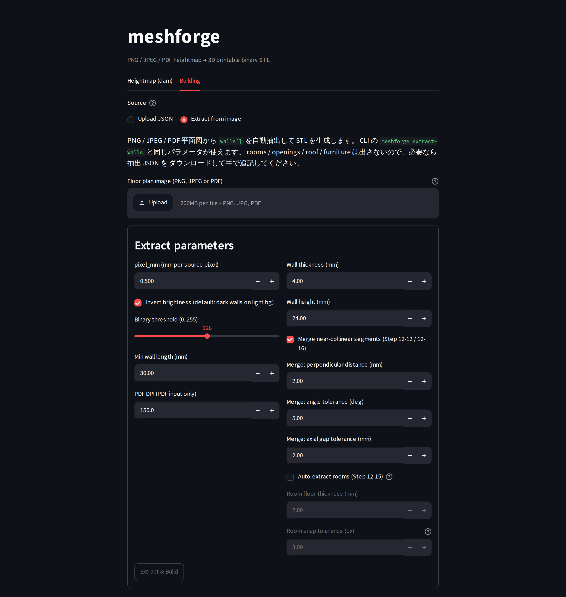

# meshforge

> **紙の図面や PDF を、3D プリンターで印刷できる立体データに変えるツール**

meshforge（メッシュフォージ）は、建物の平面図のような「平らな図面」を読み込んで、
3D プリンターで印刷できる立体データ（STL ファイル）を作るツールです。

ふつうの「図面を立体にする」ソフトと違うのは、途中に **形を編集できる段階をはさむ**
こと。たとえば「壁の高さを変える」「ドアや窓の穴をあける」といった調整を、
図面を描き直さずに数値の設定だけで変えられます。

> 💡 **STL ファイルって？**
> 3D プリンターや、その印刷準備をするソフト（スライサー。例: Bambu Lab Studio）が
> 読み込める、立体の形を表す標準的なファイル形式です。「3D プリント版の PDF」だと
> 思ってもらえれば近いです。

## 何ができる？

- 建物の平面図（PDF や画像）から、壁が立った 3D の模型データを作る
- 壁の高さ・ドアや窓の穴・屋根・家具などを数値で調整する
- できあがった形を STL ファイルとして書き出し、3D プリンターで印刷する

イメージは「もし一級建築士が 3D プリントのジオラマを作るなら」。
平面図 → 壁を立てる → 高さや開口を調整 → STL、という流れをデモで試せます。

## まず触ってみる（インストール不要）

一番かんたんなのは、ブラウザで動く公開デモです。何もインストールせずに試せます。

👉 **公開デモ: <https://meshforge.streamlit.app/>**

> しばらくアクセスがないとデモが「お休みモード」に入るため、初回は起動に
> 20〜40 秒ほどかかることがあります。

デモには 2 つのタブがあります。

- **Heightmap (dam) タブ**: 画像や PDF をアップロード → 設定を選ぶ →
  「Convert」ボタンで STL を作成。その場で 3D プレビューを回して確認し、
  ダウンロードできます。
- **Building タブ**: 建物の平面図から壁を自動で読み取って立体にする、
  より高度なタブです。読み取った壁を表で編集することもできます。

### 画面イメージ



> Building タブで「画像から壁を読み取る（Extract from image）」を選んだ画面です。
> Heightmap (dam) タブを開けば、画像 / PDF → そのまま STL の流れも使えます。

> 「Extract & Build」を押すと、読み取った壁の中心線が赤、自動で見つけた部屋の
> 輪郭が青で、元の画像に重ねて表示されます。

## しくみ（ざっくり）

meshforge は、図面をいきなり立体に「押し出す」のではなく、途中に
**編集できる立体データ** をはさみます。

```
 PDF / 画像          画像として        編集できる立体データ          STL
（図面・仕様書） →  取り込む       →  （壁の高さ・穴などを     →  （印刷用）
                                     数値で持つ）
                                           ↑
                                    ここで形を編集できる
```

この「編集できる立体データ」がポイントです。途中の状態をファイル（JSON 形式）に
保存できるので、あとから同じ設定で何度でも作り直せます。

> 最終的には専用のデスクトップアプリにする構想もありますが、まずは
> 「画像 → STL が動く」シンプルな状態から、1 ステップずつ育てています。

## 自分のパソコンで動かす

デモではなく手元で動かしたい人向けです。プログラミング言語の **Python** を使います。

### 準備（セットアップ）

リポジトリを取得したら、その中で次を実行します。
（`.venv` は、このツール専用の Python 環境を用意する仕組みです）

```sh
.venv/bin/pip install -e .            # 画像入力だけならこれだけ
.venv/bin/pip install -e '.[pdf]'     # PDF も読み込みたい場合
.venv/bin/pip install -e '.[pdf,ui]'  # ブラウザ画面（デモと同じ UI）も使う場合
```

### 画像 → STL

```sh
# お試し用の画像を作る
.venv/bin/python python/make_sample.py samples/dome.png

# 画像から STL を作る
.venv/bin/python -m meshforge convert samples/dome.png samples/dome.stl
```

入力は PNG だけでなく JPEG（`.jpg` / `.jpeg`）も使えます。拡張子が `.pdf`
以外なら Pillow がそのまま読み込み、グレースケール化して同じ処理に流します。

### 建物の平面図（黒い壁・白い床）から

`--invert` は白黒を反転、`--threshold` は壁をくっきり垂直に立てるための設定です。

```sh
.venv/bin/python -m meshforge convert samples/floorplan.png samples/floorplan.stl \
    --invert --threshold 128
```

### PDF から

拡張子が `.pdf` のときは、自動で 1 ページ目を画像にしてから処理します。
（`--dpi` で解像度を指定。既定は 150）

```sh
.venv/bin/python -m meshforge convert samples/floorplan.pdf samples/floorplan.stl \
    --invert --threshold 128 --dpi 150
```

### ブラウザ画面を手元で開く

```sh
.venv/bin/streamlit run python/meshforge/ui_streamlit.py
```

ブラウザが開き、公開デモと同じ画面で操作できます。

> 設定ファイルで結果を再現する方法、高さレイヤー、公開デモの立て方など、
> より細かい使い方は [docs/development-notes.md](docs/development-notes.md) にまとめています。

## 開発の進めかた

一度に大改修せず、各ステップで「動く成果物」を 1 つずつ積み上げる方針です。
2026-05-24 〜 2026-05-30 の数日間で、画像 → STL の最小ツールから、平面図の
自動読み取り・壁の表編集まで到達しました。

- タスク単位の歩み: [docs/progress.md](docs/progress.md)
- 段階的な計画（正本）: [docs/development-plan.md](docs/development-plan.md)
- 進捗・工数・開発ループ・各ステップの方針: [docs/development-notes.md](docs/development-notes.md)

## 使っている技術

- 言語: Python 3.11（将来 C# を足す可能性あり）
- 主なライブラリ: numpy / pillow / trimesh / PyMuPDF
- 印刷確認: Bambu Lab Studio（スライサー）

## もっと知る

- ライセンス: [MIT License](LICENSE)（自由に使えます）
- 貢献の手引き: [CONTRIBUTING.md](CONTRIBUTING.md)
- 変更履歴: [CHANGELOG.md](CHANGELOG.md)
- 開発エージェント（Claude / Codex）向けの共通規約: [AGENTS.md](AGENTS.md)
